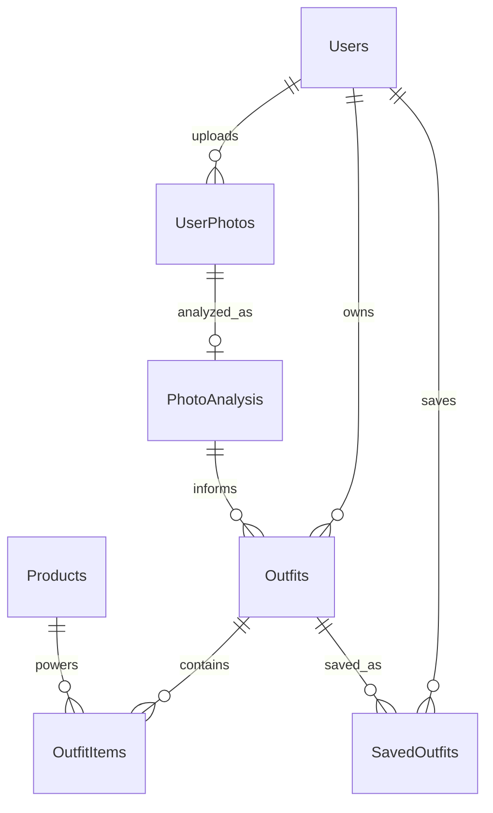

# Database Design

## Tables

### Users

Stores account, authentication, and profile fields: first name, last name, email, password hash, gender, age, height, weight, clothing size, preferred style, and budget range.

### UserPhotos

Stores uploaded photo metadata: file name, content type, size, blob name, blob URL, and owning user.

### PhotoAnalysis

Stores AI Vision analysis for a user photo: body type, skin tone, style, recommended colors, category recommendations, and raw AI response JSON.

### Outfits

Stores generated outfit headers: user, optional photo analysis, occasion, budget, weather, style preference, total estimated cost, styling explanation, and generated image URL.

### OutfitItems

Stores each complete outfit item: shirt/top, bottom, shoes, accessories, item color, price, notes, and optional linked product.

### Products

Stores normalized product search results: product name, brand, price, rating, purchase link, product image, retailer, and category.

### SavedOutfits

Stores the user's saved outfit history and notes. A unique index prevents saving the same outfit twice for the same user.

## Relationships

